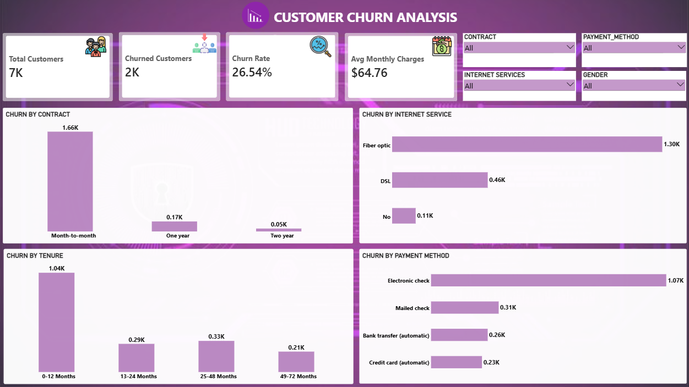
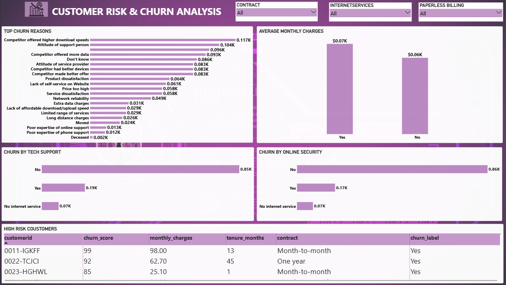

# Customer Churn Analysis using Python, SQL & Power BI

## 📊 Project Overview

This project is a **Customer Churn Analysis** built using **Python, SQL, and Power BI**.

The objective of this project is to analyze customer churn patterns, understand key churn drivers, compare customer behavior, and identify high-risk customers through an interactive **2-page Power BI dashboard**.

The project includes Python-based data cleaning and exploratory analysis, SQL business analysis queries, and a Power BI dashboard designed to present customer churn insights.

---

## 🎯 Project Objectives

- Analyze overall customer churn performance
- Calculate total and churned customers
- Understand overall churn rate
- Analyze churn across different contract types
- Compare churn across internet service types
- Analyze churn by payment method
- Understand churn patterns across tenure groups
- Analyze monthly charges by churn status
- Identify major churn reasons
- Analyze online security and tech support
- Identify high-risk customers using churn scores
- Present key customer churn KPIs in an interactive dashboard

---

## 🛠️ Tools & Technologies

| Tool | Purpose |
|---|---|
| **Python** | Data cleaning and exploratory analysis |
| **Pandas** | Data manipulation and analysis |
| **NumPy** | Numerical analysis |
| **Matplotlib / Seaborn** | Data visualization |
| **SQL / MySQL** | Data analysis and business queries |
| **Power BI** | Interactive dashboard and visualization |
| **DAX** | Measures and dashboard calculations |
| **Google Colab** | Python analysis environment |

---

# 📌 Dashboard 1 — Customer Churn Overview

### Key KPIs

- **Total Customers:** 7,043
- **Churned Customers:** 1,869
- **Churn Rate:** 26.54%
- **Average Monthly Charges:** $64.76

### Visuals Included

- Churned Customers by Contract
- Churn by Internet Service
- Churn by Tenure Group
- Churn by Payment Method
- Contract, Internet Service, Payment Method, and Gender slicers

---

# 📌 Dashboard 2 — Customer Risk & Churn Analysis

### Visuals Included

- Top Churn Reasons
- Average Monthly Charges by Churn Status
- Churned Customers by Tech Support
- Churned Customers by Online Security
- High-Risk Customers table
- Contract, Internet Service, and Paperless Billing slicers

### High-Risk Customers

The dashboard identifies customers with a **churn score of 80 or above** as high-risk customers.

The table includes:

- Customer ID
- Churn Score
- Monthly Charges
- Tenure Months
- Contract
- Churn Label

---

## 🧮 SQL Analysis

The SQL file contains **20 business analysis queries**, including:

1. Total Customers
2. Churned Customers
3. Active Customers
4. Overall Churn Rate
5. Churn Distribution
6. Churn by Gender
7. Churn by Contract
8. Churn by Internet Service
9. Churn by Payment Method
10. Churn by Tenure Group
11. Churn by Online Security
12. Churn by Tech Support
13. Churn by Paperless Billing
14. Average Monthly Charges by Churn
15. Average Total Charges by Churn
16. Customers Above Average Monthly Charges
17. Churn Reasons
18. High-Risk Customers
19. Churn Score Analysis
20. Top High-Risk Customers by Contract

The SQL analysis uses `COUNT()`, `COUNT(DISTINCT)`, `AVG()`, `GROUP BY`, `HAVING`, `ORDER BY`, `WHERE`, and `CASE`.

---

## 🐍 Python Data Analysis

Python was used for data cleaning, preprocessing, exploratory analysis, and customer churn analysis.

### Data Cleaning

- Checked dataset shape and columns
- Checked missing values
- Checked duplicate records
- Converted Total Charges into numeric format
- Handled missing Total Charges values
- Standardized column names
- Checked unique values
- Created tenure groups

### Exploratory Data Analysis

- Customer churn distribution
- Churn by contract
- Churn by internet service
- Churn by payment method
- Average monthly charges by churn status
- Average tenure by churn status
- Average total charges by churn status
- Churn analysis by tenure group

### Python Visualizations

- Customer Churn Distribution
- Churn by Contract Type
- Monthly Charges vs Churn
- Tenure vs Churn

---

## 📈 Business Insights

- The dataset contains **7,043 customers**.
- **1,869 customers** are identified as churned customers.
- The overall churn rate is approximately **26.54%**.
- Contract and internet service types provide useful segmentation for churn analysis.
- Tenure groups help identify differences in customer churn patterns.
- Churn reasons provide information about common causes associated with customer loss.
- Customers with higher churn scores can be identified as high-risk customers.

---

## 📂 Project Files

```text
Customer_Churn_Analysis/
│
├── customer_churn_cleaned.csv
├── Customer_Churn_Analysis.sql
├── Customer_Churn_Analysis.ipynb
├── Customer_Churn_Analysis.pbix
├── README.md
│
└── images/
    ├── Dashboard_1_Customer_Churn_Overview.png
    └── Dashboard_2_Customer_Risk_Churn.png
```

> Upload the two dashboard screenshots into an `images` folder in GitHub so the images displayed below work correctly.

---

## 🖼️ Dashboard Preview

### Dashboard 1 — Customer Churn Overview



### Dashboard 2 — Customer Risk & Churn Analysis



---

## 🔄 Project Workflow

```text
Telco Customer Churn Dataset
        ↓
Python Data Cleaning
        ↓
Exploratory Data Analysis
        ↓
Cleaned CSV Dataset
        ↓
MySQL Database
        ↓
SQL Business Analysis
        ↓
Power BI Data Model
        ↓
DAX Measures
        ↓
Interactive Visualizations
        ↓
2-Page Customer Churn Dashboard
```

---

## 💡 Skills Demonstrated

- Python Data Analysis
- Data Cleaning
- Pandas
- NumPy
- Data Visualization
- SQL / MySQL
- Aggregate Functions
- GROUP BY and HAVING
- Filtering and Sorting
- Power BI Dashboard Development
- DAX Measures
- KPI Design
- Customer Churn Analysis
- Risk Analysis
- Business Insights and Storytelling

---

## 👩‍💻 Project Summary

This project demonstrates how customer data can be transformed into meaningful business insights using **Python, SQL, and Power BI**.

The analysis focuses on understanding customer churn patterns, identifying churn drivers, comparing customer segments, and highlighting high-risk customers through an interactive 2-page dashboard.

---

## ⭐ Conclusion

The Customer Churn Analysis project provides an interactive view of customer churn, churn drivers, customer behavior, and high-risk customers.

The combination of **Python data analysis + SQL business analysis + Power BI visualization** demonstrates an end-to-end data analytics workflow and provides a practical approach to customer churn analysis.
